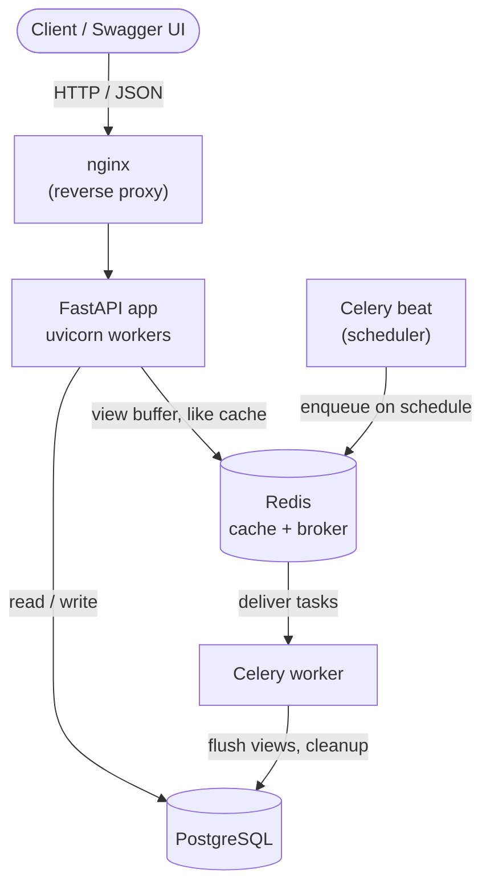
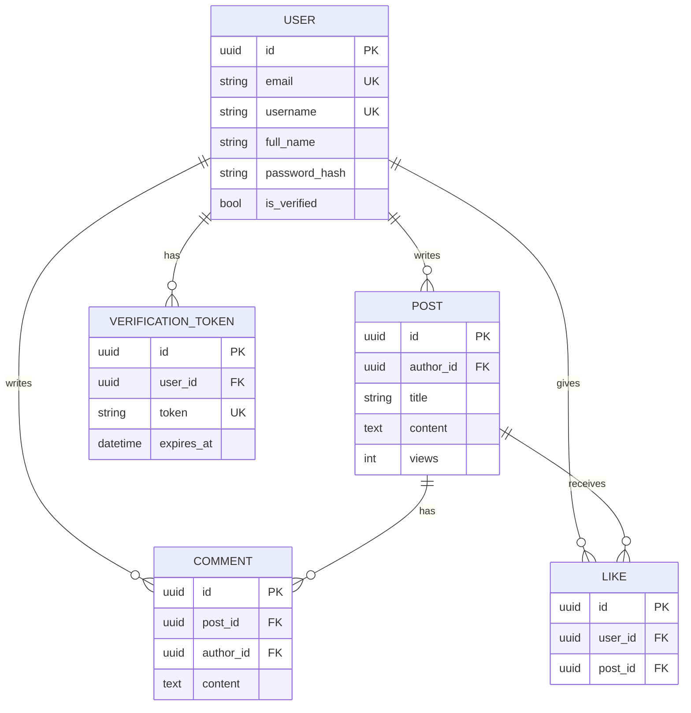
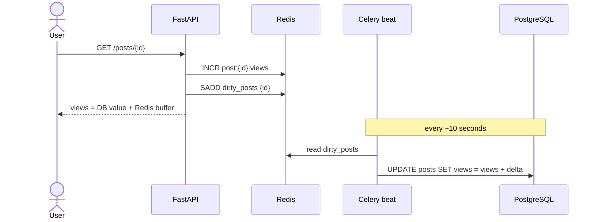
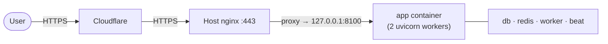

# Mini Social Network — Backend


A backend for a mini social network — users, posts, comments, likes, JWT auth,
email verification and background jobs — built with **FastAPI · PostgreSQL ·
Redis · Celery**, fully containerized with Docker.

> Test-assignment implementation, focused on **architecture, code quality and correctness** rather than feature count.

---

## Table of contents

- [Features](#-features)
- [Architecture](#️-architecture)
- [Data model](#️-data-model)
- [How views scale](#-how-views-scale-write-behind-buffering)
- [Tech stack](#-tech-stack)
- [Quick start](#-quick-start)
- [API](#-api)
- [Tests & code quality](#-tests--code-quality)
- [Production deployment](#-production-deployment)
- [Project structure](#-project-structure)
- [Roadmap](#️-roadmap)

---

## ✨ Features

- 🔐 **JWT auth** — register / login / me / profile, bcrypt password hashing
- ✉️ **Email verification** with expiring tokens (no real SMTP — simulated in logs)
- 📝 **Posts** CRUD with ownership & verified-user rules
- 💬 **Comments** and ❤️ **likes** — can't like your own post, one like per user (DB-enforced)
- 👁️ **View counter** buffered in Redis, flushed to PostgreSQL by Celery
- 🔎 **Feed** (`/all`), pagination, keyword search, date filtering
- ⚙️ **Celery** worker + beat — cleanup stale users, flush views, post TTL
- 🛡️ **Login rate limiting** (bruteforce protection)
- ✅ **22 tests**, ruff lint + format, pre-commit, GitHub Actions CI
- 🐳 **One command** Docker startup with automatic migrations; nginx for production

---

## 🏗️ Architecture



Inside the app, every request flows through clean layers:

```
router  →  service  →  repository  →  model
(HTTP)     (rules)     (DB queries)   (ORM)
```

---

## 🗂️ Data model



A **unique constraint** on `LIKE (user_id, post_id)` guarantees one like per user per post at the database level.

---

## ⚡ How views scale (write-behind buffering)

High-traffic view counts would hammer the database if written on every request.
Instead they are **buffered in Redis** and flushed to PostgreSQL in batches:



The trade-off is deliberate and **applied only where it's safe**:

| Data | Strategy | Why |
| ---- | -------- | --- |
| 👁️ Views | Buffered in Redis, batch-flushed | High volume, approximate is fine |
| ❤️ Likes | Written straight to Postgres; Redis caches the count | Must not be lost |
| 💬 Comments | Written straight to Postgres | Must not be lost |

---

## 🧰 Tech stack

| Layer            | Technology                                       |
| ---------------- | ------------------------------------------------ |
| Language         | Python 3.12                                      |
| Web framework    | FastAPI (async)                                  |
| Database         | PostgreSQL 16 (SQLAlchemy 2.0 + asyncpg)         |
| Migrations       | Alembic                                          |
| Cache / broker   | Redis 7                                          |
| Background tasks | Celery (worker + beat)                           |
| Tests / quality  | pytest, httpx, fakeredis, ruff, pre-commit       |
| Deployment       | Docker + docker-compose, nginx                   |

---

## 🚀 Quick start

```bash
# 1. Copy the environment template
cp .env.example .env

# 2. Build and run everything
docker compose up --build
```

Then open:

- **API** → http://localhost:8000
- **Swagger UI** (interactive docs) → http://localhost:8000/docs

> On first start, a one-shot `migrate` service applies the database schema
> (Alembic) automatically before the API and Celery services come up — no manual
> migration step.

### Services

| Service   | Description                       | Port  |
| --------- | --------------------------------- | ----- |
| `app`     | FastAPI application               | 8000  |
| `db`      | PostgreSQL database               | 5432  |
| `redis`   | Redis (cache + Celery broker)     | 6379  |
| `worker`  | Celery worker (background tasks)  | —     |
| `beat`    | Celery beat (periodic scheduler)  | —     |
| `migrate` | One-shot Alembic migration        | —     |

---

## 📡 API

All endpoints exchange JSON. Full interactive docs (schemas + "Try it out") live at **`/docs`**.

| Method | Path | Auth | Description |
| ------ | ---- | ---- | ----------- |
| POST | `/auth/register` | – | Register (creates an unverified user) |
| POST | `/auth/login` | – | Log in, returns a JWT |
| GET | `/auth/me` | Bearer | Current user |
| POST | `/auth/request-verification` | – | (Re)issue an email-verification token |
| GET | `/auth/verify-email?token=` | – | Verify email |
| PATCH | `/users/me` | Bearer | Update profile |
| GET | `/posts` | Bearer | List posts (pagination, `search`, `date_from`/`date_to`) |
| POST | `/posts` | Verified | Create a post |
| GET | `/posts/{id}` | Bearer | Post detail (comments + likes; registers a view) |
| PATCH | `/posts/{id}` | Owner | Update a post |
| DELETE | `/posts/{id}` | Owner | Delete a post |
| GET | `/posts/{id}/comments` | Bearer | List comments |
| POST | `/posts/{id}/comments` | Verified | Add a comment |
| DELETE | `/posts/{id}/comments/{cid}` | Owner | Delete a comment |
| POST | `/posts/{id}/like` | Bearer | Like a post |
| DELETE | `/posts/{id}/like` | Bearer | Unlike a post |
| GET | `/all` (or `/feed`) | Bearer | Users → their posts → likes (paginated) |

_"Verified" = requires a verified email; "Owner" = only the author/owner._

Three access levels are enforced:

| State | Token | Verified | View / like | Post / comment |
| ----- | :---: | :------: | :---------: | :------------: |
| Anonymous | ❌ | — | 401 | 401 |
| Logged in, unverified | ✅ | ❌ | ✅ | 403 |
| Logged in, verified | ✅ | ✅ | ✅ | ✅ |

---

## 🧪 Tests & code quality

22 tests cover authentication, access control (verified / owner rules), likes
(own-post / double-like), email verification, and the maintenance functions —
run against a dedicated `social_test` database with an in-memory fake Redis.

```bash
docker compose exec app pip install -r requirements-dev.txt
docker compose exec app pytest
```

Linting and formatting use **ruff**. A `.pre-commit-config.yaml` runs it on every
commit, and GitHub Actions (`.github/workflows/ci.yml`) lints + tests on push.

```bash
docker compose exec app ruff check .
docker compose exec app ruff format --check .
```

---

## 🌐 Production deployment

Two options are provided.

**A. Standalone** — nginx is the single entry point (`docker-compose.prod.yml`):

```bash
docker compose -f docker-compose.prod.yml up -d --build
```

**B. Behind an existing reverse proxy** — for a server that already runs nginx
(e.g. with Cloudflare in front). The app binds to `127.0.0.1` and your host nginx
proxies a subdomain to it (`docker-compose.server.yml` + `deploy/social-api.nginx.conf`):



Both run several uvicorn workers (no auto-reload) and honour `X-Forwarded-For`,
so login rate limiting sees real client IPs. The server variant adds per-container
memory limits to stay a good neighbour on a shared host.

**Before going live:** set `DEBUG=false` and a strong random `JWT_SECRET`, change
the default PostgreSQL password, and terminate TLS at nginx (Let's Encrypt or a
Cloudflare Origin Certificate).

---

## 📁 Project structure

```
app/
├── main.py              # FastAPI entry point + router registration
├── core/                # config, database (async), redis, security (JWT & hashing)
├── models/              # ORM models: User, Post, Comment, Like, VerificationToken
├── schemas/             # Pydantic request/response models + validation
├── repositories/        # database queries (data-access layer)
├── services/            # business rules (auth, posts, comments, likes, feed, ...)
├── tasks/               # Celery app + background tasks (cleanup, view flush, post TTL)
└── api/
    ├── deps.py          # shared dependencies (current user, DB session, services)
    └── routers/         # HTTP endpoints grouped by resource
alembic/                 # database migrations
tests/                   # pytest suite
deploy/                  # host-nginx vhost template
nginx/                   # reverse-proxy config (standalone prod)
docker-compose.yml       # dev
docker-compose.prod.yml  # production (standalone, own nginx)
docker-compose.server.yml# production (behind an existing reverse proxy)
```

---

## 🗺️ Roadmap

- [x] Stage 0 — Project skeleton (Docker, FastAPI, config)
- [x] Stage 1 — Database models & migrations
- [x] Stage 2 — Auth (JWT, register, login)
- [x] Stage 3 — Email verification
- [x] Stage 4 — Posts
- [x] Stage 5 — Comments & likes
- [x] Stage 6 — Feed, pagination, search, filters
- [x] Stage 7 — Celery (unverified-user cleanup + view flush)
- [x] Stage 8 — Tests
- [x] Stage 9 — Docker & docs finalization

### Bonus (implemented)

- [x] Post lifetime — auto-delete old posts (Celery beat)
- [x] Login rate limiting — bruteforce protection (Redis)
- [x] Extended tests — permissions, likes, verification, maintenance
- [x] Ruff (lint + format), pre-commit hooks, GitHub Actions CI
- [x] Production deployment — nginx reverse proxy + shared-server variant
